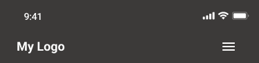
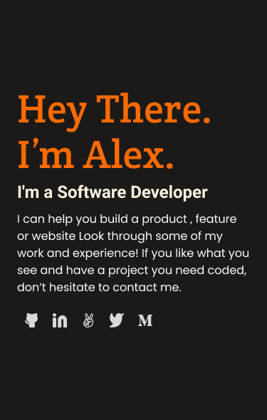

# Portfolio: setup and mobile first

Add First setup for my portfolio follow the guideline on the activite "Portfolio: setup and mobile first" 

> Is going to have the following features: 

- Linters html/css setup
- Toolbar  (Header) in mobile version first
- The headline section in mobile version first

The result should be the following:

 
    
  
   

Will have future changes in the next days! 

## 🚀 Live Demo 

> Work in progresss 

### Tech Stack 

  
Client

  <ul>
    <li><a href="https://reactjs.org/">HTML</a></li>
    <li><a href="https://reactjs.org/">CSS</a></li>
  </ul>

### Install

1. Go to the [repository page](https://github.com/enmanuelbayen/Portfolio/tree/main).
2. Press the "Code" button and copy the link.
3. Clone it using git command `git clone <link>`.

### Usage

To run the project, execute the following command:

Open index.html using live server extension.

## 👥 Authors 

> Mention all of the collaborators of this project.

👤 Enmanuel Bayen

- GitHub: [@githubhandle](https://github.com/enmanuelbayen)
- Twitter: [@twitterhandle](https://twitter.com/EJbayen)
- LinkedIn: [LinkedIn](https://www.linkedin.com/in/enmanuel-bayen-torres-480906128/)

## 🔭 Future Features 

> Describe 1 - 3 features you will add to the project.

- [ ] More designs and styles!
- [ ] Better funcionality.
- [ ] More Imagen and maybe some videos.

## ⭐️ Show your support 

If you like this project just keep an eye on the changes that I will bring over time, having an audience on this journey is enough support!

## 🤝 Contributing 

Contributions, issues, and feature requests are welcome! Will help me a lot to improve my coding skills.

Feel free to check the [issues page](../../issues/).

## 🙏 Acknowledgments 

I would like to thank to my family and God for the opportunities to always improve despite adversity, my girlfriend and friends for being there for me, and Microverse for providing a platform to achieve this goal.

## 📝 License 

This project is [MIT](./LICENSE) licensed.